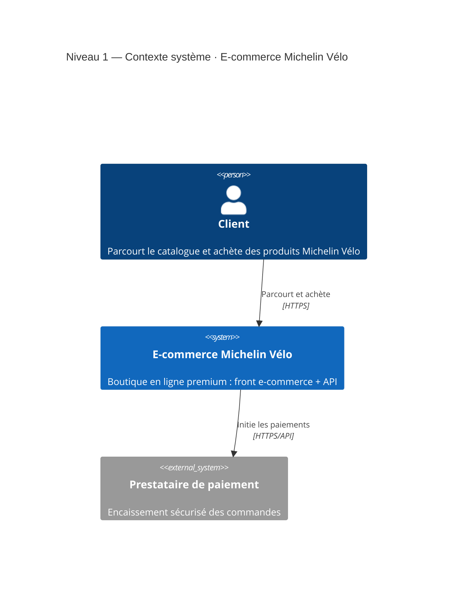
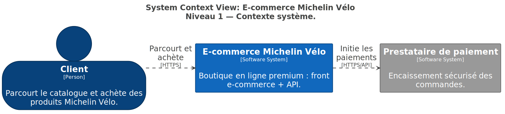
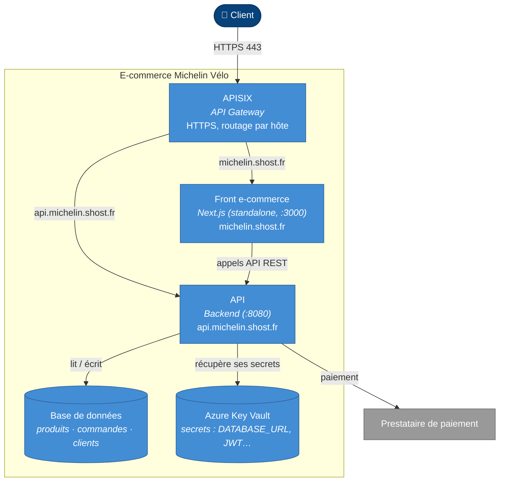
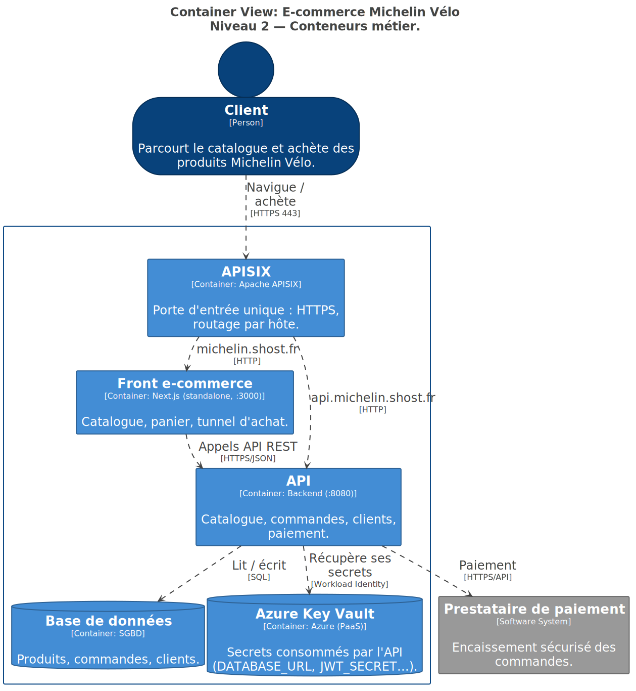
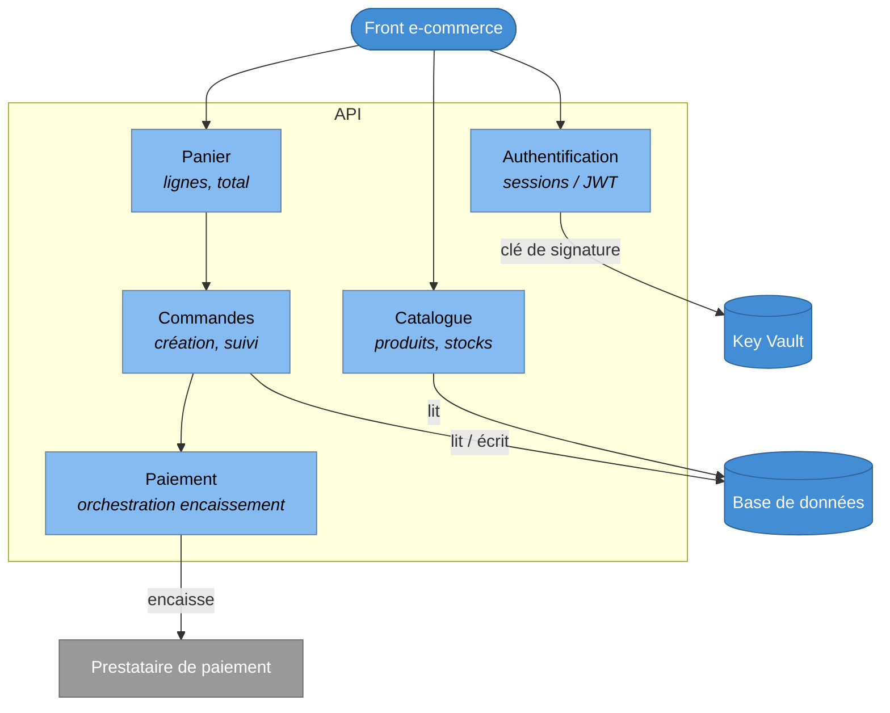
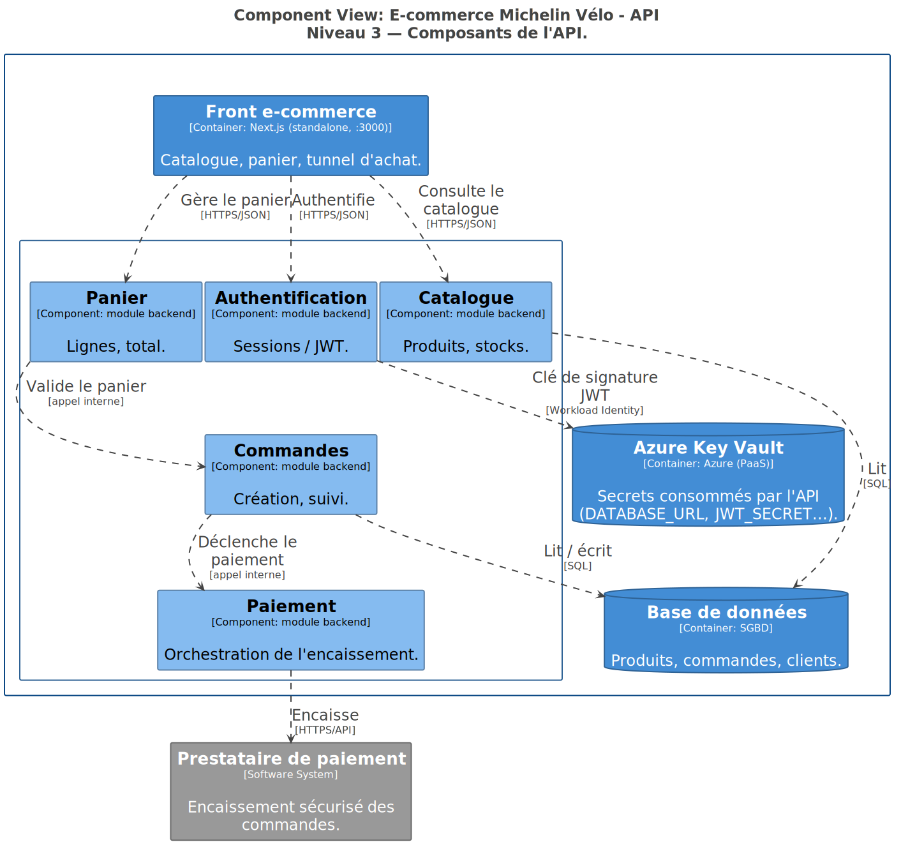

# Modèle C4 — diagrammes

Cette page décrit l'architecture **métier** du projet **Michelin Vélo** avec le
[modèle C4](https://c4model.com/) : on zoome progressivement du contexte général
(niveau 1) jusqu'aux composants de l'API (niveau 3).

!!! note "Périmètre : le métier, pas la plateforme"
    Ces diagrammes ne montrent que les **blocs métier utiles** : l'e-commerce,
    l'API, la gateway, les données et le paiement. L'outillage de plateforme et de
    livraison (Argo CD, Argo Rollouts, cert-manager, External Secrets, CI/CD…) n'y
    figure pas — il est décrit dans [Schémas d'infrastructure](infrastructure.md).

Les diagrammes ci-dessous sont rendus à la volée (Mermaid). La **source de vérité
C4** est par ailleurs versionnée en [Structurizr DSL](#source-structurizr) :
`diagrams/structurizr/workspace.dsl` dans ce repo.

!!! info "Légende des couleurs"
    Convention C4 utilisée sur toute la page :

    <span style="background:#08427b;color:#fff;padding:2px 8px;border-radius:3px">Personne</span>
    &nbsp;
    <span style="background:#1168bd;color:#fff;padding:2px 8px;border-radius:3px">Système (nous)</span>
    &nbsp;
    <span style="background:#438dd5;color:#fff;padding:2px 8px;border-radius:3px">Conteneur</span>
    &nbsp;
    <span style="background:#85bbf0;color:#000;padding:2px 8px;border-radius:3px">Composant</span>
    &nbsp;
    <span style="background:#999999;color:#fff;padding:2px 8px;border-radius:3px">Système externe</span>

---

## Niveau 1 — Contexte système

Qui utilise l'e-commerce Michelin Vélo et les systèmes externes essentiels au
parcours d'achat.



??? abstract "Même vue rendue par Structurizr (SVG exporté du DSL)"
    { loading=lazy }

---

## Niveau 2 — Conteneurs

Les unités déployables qui composent l'e-commerce, plus les briques dont l'API a
besoin pour fonctionner (données, secrets, paiement).



??? abstract "Même vue rendue par Structurizr (SVG exporté du DSL)"
    { loading=lazy }

| Conteneur | Techno | Rôle |
| --- | --- | --- |
| **APISIX** | Apache APISIX | Porte d'entrée unique HTTPS, routage par hôte |
| **Front e-commerce** | Next.js (standalone, port 3000) | Boutique client (catalogue, panier, tunnel d'achat) |
| **API** | Backend (port 8080) | Catalogue, commandes, clients, paiement |
| **Base de données** | SGBD | Données produits / commandes / clients |
| **Azure Key Vault** | Azure (PaaS) | Secrets consommés par l'API (`DATABASE_URL`, `JWT_SECRET`…) |

---

## Niveau 3 — Composants de l'API

Découpage fonctionnel interne de l'**API**, le cœur métier du parcours d'achat.

!!! warning "Découpage indicatif"
    Ce niveau reflète les domaines métier typiques d'un e-commerce et les besoins
    visibles depuis la plateforme (auth via `JWT_SECRET`, données via
    `DATABASE_URL`, paiement externe). Il est à **affiner par l'équipe API** selon
    le découpage réel du code.



??? abstract "Même vue rendue par Structurizr (SVG exporté du DSL)"
    { loading=lazy }

---

## Source Structurizr

Le modèle C4 canonique est décrit en **Structurizr DSL** dans ce repo :

```
diagrams/structurizr/workspace.dsl
```

Pour le rendre en local (vues interactives, export PNG/SVG/PlantUML) :

```bash
docker run -it --rm -p 8080:8080 \
  -v "$(pwd)/diagrams/structurizr:/usr/local/structurizr" \
  structurizr/structurizr local
# puis ouvrir http://localhost:8080
```

Le DSL contient les vues *SystemContext*, *Container* et *Component* (API), plus
un *Deployment* (projection des conteneurs métier sur Azure / AKS).
Mettez-le à jour en même temps que les diagrammes Mermaid de cette page pour
qu'ils restent cohérents.

### Réexporter les SVG

Les images Structurizr intégrées dans cette page (et la vue de déploiement sur la
page [Schémas d'infrastructure](infrastructure.md)) sont exportées du DSL en deux
étapes, puis copiées dans `docs/assets/structurizr/` :

```bash
cd diagrams/structurizr
# 1. DSL -> PlantUML
docker run --rm -v "$(pwd):/work" structurizr/structurizr \
  export -workspace /work/workspace.dsl -format plantuml -output /work/export
# 2. PlantUML -> SVG
docker run --rm -v "$(pwd)/export:/data" plantuml/plantuml -tsvg "/data/*.puml"
# 3. copier les 4 vues vers docs/assets/structurizr/{contexte,conteneurs,composants-api,deploiement}.svg
```
