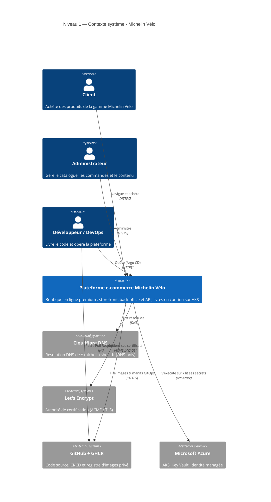
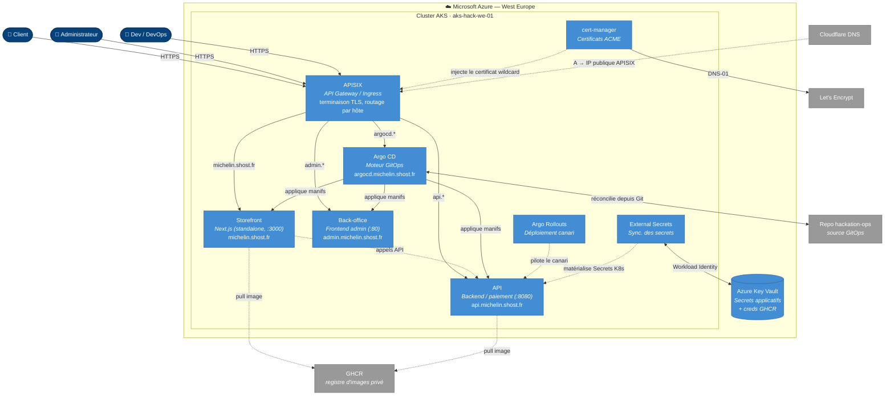
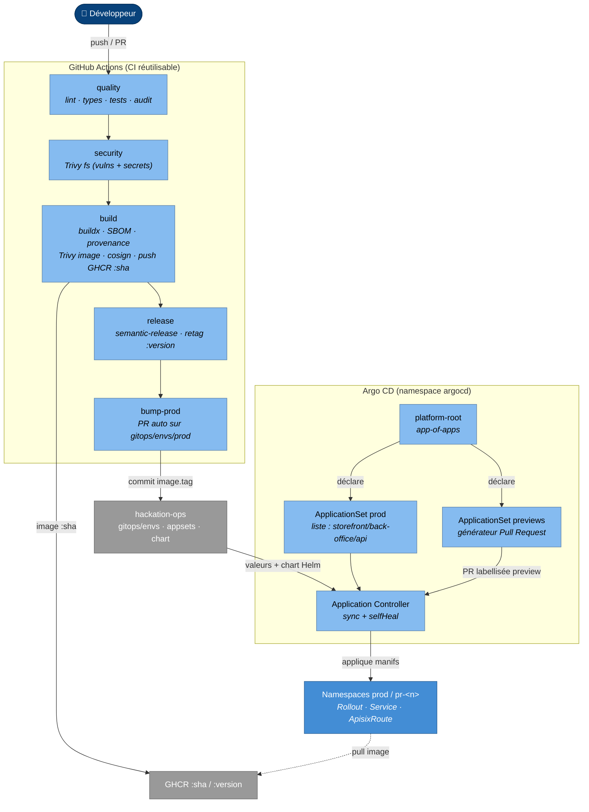

# Modèle C4 — diagrammes

Cette page décrit l'architecture du projet **Michelin Vélo** avec le
[modèle C4](https://c4model.com/) : on zoome progressivement du contexte général
(niveau 1) jusqu'aux composants internes (niveau 3), puis on projette le tout sur
l'infrastructure réelle ([Schémas d'infrastructure](infrastructure.md)).

Les diagrammes ci-dessous sont rendus à la volée (Mermaid). La **source de vérité
C4** est par ailleurs versionnée en [Structurizr DSL](#source-structurizr) :
`diagrams/structurizr/workspace.dsl` dans ce repo.

!!! info "Légende des couleurs"
    Convention C4 utilisée sur toute la page :

    <span style="background:#08427b;color:#fff;padding:2px 8px;border-radius:3px">Personne</span>
    &nbsp;
    <span style="background:#1168bd;color:#fff;padding:2px 8px;border-radius:3px">Système (nous)</span>
    &nbsp;
    <span style="background:#438dd5;color:#fff;padding:2px 8px;border-radius:3px">Conteneur</span>
    &nbsp;
    <span style="background:#85bbf0;color:#000;padding:2px 8px;border-radius:3px">Composant</span>
    &nbsp;
    <span style="background:#999999;color:#fff;padding:2px 8px;border-radius:3px">Système externe</span>

---

## Niveau 1 — Contexte système

Qui utilise la boutique Michelin Vélo et avec quels systèmes externes elle dialogue.



---

## Niveau 2 — Conteneurs

Les unités déployables qui composent la plateforme : applications, gateway et
socle de plateforme tournant dans le cluster AKS.



| Conteneur | Techno | Rôle |
| --- | --- | --- |
| **Storefront** | Next.js (standalone, port 3000) | Boutique client |
| **Back-office** | Frontend (port 80) | Administration |
| **API** | Backend (port 8080) | Données, commandes, paiement |
| **APISIX** | Apache APISIX (Helm) | Gateway unique, TLS, routage par hôte |
| **Argo CD** | argo-cd (Helm) | Réconciliation GitOps |
| **Argo Rollouts** | argo-rollouts (Helm) | Canari 25 % → 50 % → 100 % |
| **cert-manager** | jetstack (Helm) | Certificat wildcard Let's Encrypt (DNS-01) |
| **External Secrets** | ESO (Helm) | Sync. Azure Key Vault → Secrets K8s |

---

## Niveau 3 — Composants : la chaîne de livraison

Zoom sur le **moteur GitOps** (Argo CD) et la façon dont une application arrive
dans le cluster, du commit à la mise en production.



**Lecture :** la CI de l'app produit une image signée (`:sha` puis `:version`),
puis ouvre une PR de *bump* sur `hackation-ops`. Argo CD détecte le commit et
réconcilie le cluster — c'est le seul chemin vers la prod. Détails du flux :
[GitOps & flux de déploiement](gitops.md).

---

## Source Structurizr

Le modèle C4 canonique est décrit en **Structurizr DSL** dans ce repo :

```
diagrams/structurizr/workspace.dsl
```

Pour le rendre en local (vues interactives, export PNG/SVG/PlantUML) :

```bash
docker run -it --rm -p 8080:8080 \
  -v "$(pwd)/diagrams/structurizr:/usr/local/structurizr" \
  structurizr/lite
# puis ouvrir http://localhost:8080
```

Le DSL contient les vues *SystemContext*, *Container*, *Component* et un
*Deployment* (projection sur Azure / AKS). Mettez-le à jour en même temps que les
diagrammes Mermaid de cette page pour qu'ils restent cohérents.
