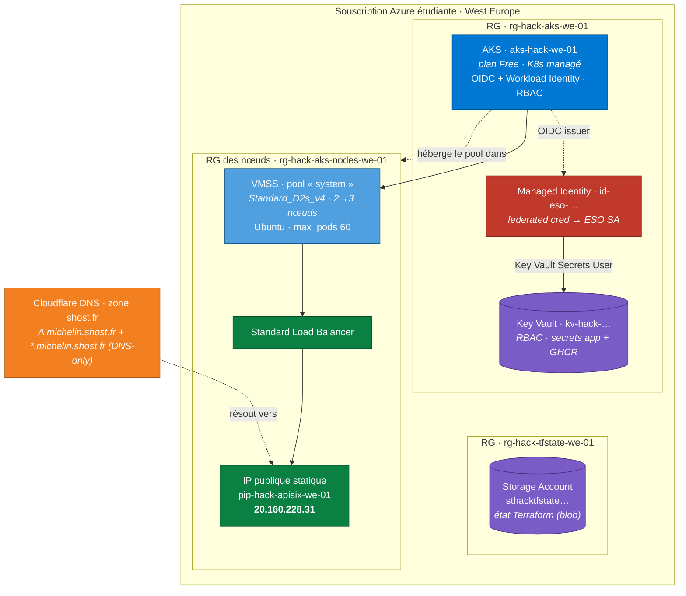
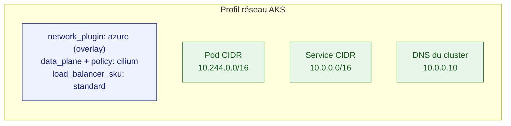
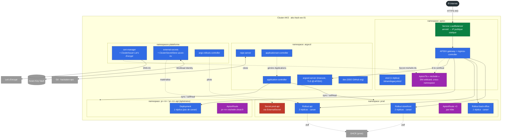
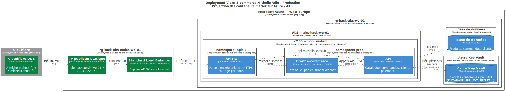
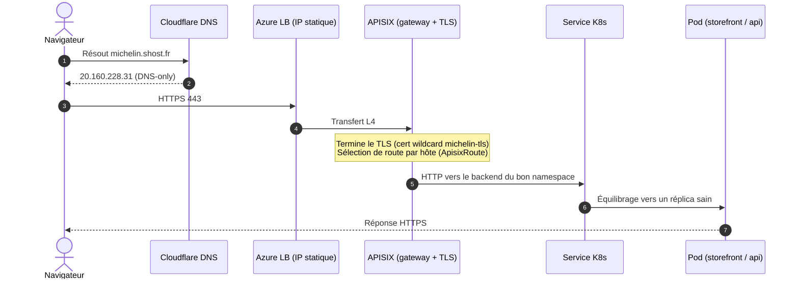

# Schémas d'infrastructure

Projection concrète de l'[architecture C4](c4.md) sur **Azure** et sur le **cluster
Kubernetes**. Le socle est provisionné par Terraform ; les applications sont livrées
par Argo CD ([frontière](architecture.md)).

!!! note "Contraintes de dimensionnement"
    Souscription Azure étudiante, **quota régional de 10 vCPU** (West Europe).
    Pool de nœuds `Standard_D2s_v4` (2 vCPU), autoscale **2 → 3**, `max_surge = 1`,
    et un **unique** LoadBalancer APISIX. Tout est dimensionné pour rester dans ce quota.

---

## 1. Ressources Azure

Groupes de ressources, cluster, identités et réseau public.

| Groupe de ressources | Contenu |
| --- | --- |
| `rg-hack-tfstate-we-01` | Storage Account = backend d'état Terraform (bootstrap, une fois). |
| `rg-hack-aks-we-01` | Cluster AKS, Key Vault, identité managée ESO. |
| `rg-hack-aks-nodes-we-01` | Ressources gérées par AKS : VMSS (nœuds), Load Balancer, **IP publique statique** d'APISIX. |

L'IP publique est créée **par nom** dans le RG des nœuds pour qu'APISIX (déployé
plus tard) l'attache via les annotations de son `Service`, et que le DNS pointe
dessus de façon stable.

---

## 2. Réseau du cluster

Plugin réseau et plages d'adressage (Azure CNI **overlay**, dataplane **Cilium**).

- **Overlay** : les pods ont des IP hors du VNet (pas de consommation d'IP du subnet) → adapté au petit quota.
- **Cilium** assure à la fois le data plane et les *NetworkPolicies*.

---

## 3. Topologie Kubernetes

Vue interne du cluster : namespaces, charges applicatives et ressources de plateforme.

??? abstract "Vue de déploiement Structurizr (conteneurs métier sur Azure / AKS, SVG exporté du DSL)"
    { loading=lazy }

!!! tip "Une seule porte d'entrée, un seul certificat"
    Tout le trafic entre par le `Service` LoadBalancer **unique** d'APISIX (IP
    publique statique). La ressource `ApisixTls` sert le certificat wildcard
    `michelin-tls` pour **tous** les hôtes, quel que soit le namespace du backend
    (prod comme `pr-<n>`). Voir [Hostnames & DNS](../reference/hostnames.md).

---

## 4. Cheminement d'une requête (TLS de bout en bout)

---

## 5. Pipeline CI/CD → cluster

De `git push` jusqu'au canari en production. Détail du raisonnement :
[GitOps & flux de déploiement](gitops.md).

```mermaid
flowchart LR
  push(["git push / PR<br/>(repo app)"]):::trigger

  subgraph gha["GitHub Actions — reusable-node-ci"]
    q["quality<br/>lint·types·tests·audit"]:::job
    s["security<br/>Trivy fs"]:::job
    b["build<br/>buildx · SBOM · provenance<br/>Trivy image · cosign"]:::job
    r["release<br/>semantic-release"]:::job
  end

  ghcr["GHCR (privé)<br/>:sha → :version"]:::ext
  bumpPR["PR auto bump<br/>gitops/envs/prod/&lt;app&gt;"]:::trigger

  subgraph k8s["Cluster AKS"]
    argo["Argo CD<br/>sync"]:::svc
    canary["Argo Rollouts<br/>25% → 50% → 100%"]:::svc
    prod["Pods prod"]:::pod
  end

  push --> q --> s --> b --> r
  b -->|"image signée :sha"| ghcr
  r -->|version SemVer| bumpPR
  r -->|"retag :version"| ghcr
  bumpPR -->|merge auto sur main| argo
  argo --> canary --> prod
  prod -. "pull image signée" .-> ghcr

  classDef trigger fill:#fbc02d,stroke:#b58a00,color:#000;
  classDef job fill:#85bbf0,stroke:#5d82a8,color:#000;
  classDef svc fill:#0b8043,stroke:#054d28,color:#fff;
  classDef pod fill:#326ce5,stroke:#1a3a8f,color:#fff;
  classDef ext fill:#999999,stroke:#6b6b6b,color:#fff;
```

Les **previews de PR** ne passent pas par le *bump* : l'`ApplicationSet` à
générateur Pull Request lit directement le SHA de la PR et déploie un
`Deployment` simple (sans canari) dans un namespace `pr-<n>` éphémère, supprimé à
la fermeture de la PR.
